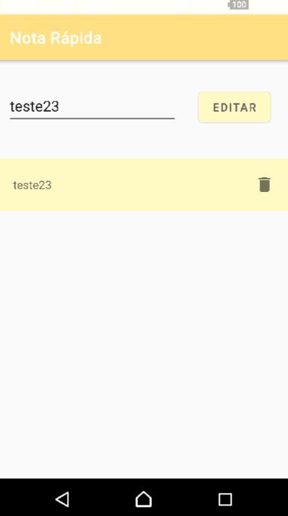

# Nota Rápida - APP

Nota Rápida é um aplicativo nativo feito com a linguagem Kotlin. Projeto num. **1**  
*Detalhes/Bibliotecas:*
- **Arquitetura MVVM**
- **Room**
- **RecyclerView / DiffUtil**
- **Navigation Fragment**
- **Coroutine**
- **Data Binding**

## Tour pelo APP:

### UI onde ficam o botão de Adicionar e as notas inseridas.
 

-------

### UI com Nota adicionada.

-------

### UI com Notas no RecyclerView.

-------

### Nota deletada.

-------

### Mudança na UI para edição. Segurar na nota que deseja ser alterada

-------

### Nota alterada.

-------

### Exemplo lista cheia.

